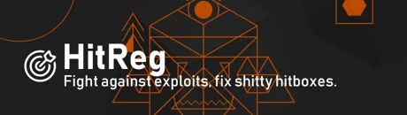

# LeyHitreg
A GMod Hit-Registration addon from 2017, release builds available at https://steamcommunity.com/sharedfiles/filedetails/?id=3421440369

## Debugging Hit-Registration
The initialization file leyhitreg/lua/autorun/leyhitreg.lua contains variables to allow you to debug the hit registration behaviour with the addon.

## Contribution
Feel free to contribute.
This addon was meant as a contribution to the community, to be extended and used by the community - hence the high modularity of code.

## How does it work
Normally the game sends a packet to the server saying he wants to shoot a bullet and the entire hit registration/confirmation is done serverside, while the client tries to determine whether he hit/not using his own view of the game based on his tick. However, the data of the client and the server does not always match up. Therefore, the server uses certain algorithms to roll back the state depending on how much the user lagged. This is referred to as lag compensation. The main issue is, this kind of rollback isn't perfect especially since the server does not have all data and the two are not fully synced up.

That's the issue this addon tackles. To solve this, the client additionally tells the server whether his shot was a hit and which hit group he shot. This solves the issue since the client is the one dictating whether a shot was a hit. If the client doesn't send a shot then the game just does its normal serverside HitReg. Additionally, the server has validations for checking whether the shot being sent is reasonable to avoid exploitation, such as shooting through walls.

In addition, the addon uses the same way of networking as for the source engines movement packets (usercommands), recuding networking overhead and ensuring processing of the hit/miss shot signal from the client happens at a time-point closeby to processing of the players shot.

## Example
https://www.youtube.com/watch?v=dUQe6RRDp3A
In the aforementioned video example, source out of box fails to register hits which arrive on the models feet. With LeyHitreg, those hits register.

## For DEVs:
You are welcome to contribute. If you feel there is any feature missing, or something else you think this addon needs, you can open a pull request.

### File structure
- Initialization happens in lua/autorun/leyhitreg.lua
- The code is split between the different realms
- - lua/leyhitreg/client
  - lua/leyhitreg/shared
  - lua/leyhitreg/server
 - For each realm, modules exist, e.g. to fix CTakeDamageInfo related functionality
 - -  lua/leyhitreg/server/damageinfo/fixcsaling.lua
   -  lua/leyhitreg/server/damageinfo/scaledamagehack.lua
### API
- All functionality is exposed under the LeyHitreg table, allowing full overwriting of default behaviour
- - e.g. LeyHitreg.Disabled = true/false or LeyHitreg.
- The addon contains various hooks, for extension
- - e.g. LeyHitreg.OnBulletCallback
### Debugging HitRegistration
The file lua/autorun/leyhitreg.lua contains various debugging flags.
These can be used to debug both - the games hitreg with the addon, and the games hitreg with it disabled.
It can report things such as the hitgroups mismatching on the serverside and clientside or affect behaviour, e.g. toggling off spread applications.
Example setting:
LeyHitreg.NoSpread = false -- debug: enable nospread for everyone
### CI/CD
Currently the addon contains a CI/CD Pipeline which:

- CI: Verifies the syntactic correctness of the lua code
- CI: Performs automatic linting for the lua code
- CD: Pushes the lua code to gmodstore.com

Ideally it should be changed to zip the addons source code, and publish the release to steam workshop and github releases.
